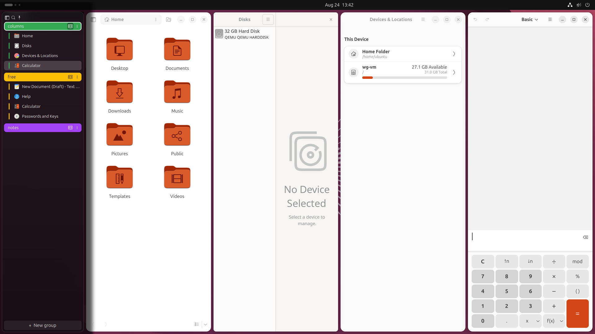

# Window Groups

[](https://github.com/toabctl/gnome-shell-extension-window-groups/actions/workflows/ci.yml)

A left sidebar of your open windows, organised into named, coloured groups —
GNOME Shell's answer to Chrome's vertical tab groups. Each group decides for
itself how its windows are arranged: left alone, or tiled in columns.



- **Groups** with names and colours. Drag a window between them, drag a group
  header to reorder.
- **Per-group layouts** — leave windows alone, or tile them in columns,
  toggled from the group header.
- **Auto-hide** by default: the sidebar stays out of the way and slides in
  when you push the pointer at the left edge. Pin it if you'd rather it
  stayed.
- **Compact mode** collapses it to icons, expanding on hover.
- **Search** every open window with <kbd>Super</kbd>+<kbd>Shift</kbd>+<kbd>A</kbd>,
  and switch or move between groups from the keyboard.
- **X11 works** exactly like Wayland — Mutter presents XWayland clients
  identically, so there is nothing special to do.

Requires GNOME Shell 48–51.

## Install

```sh
git clone https://github.com/toabctl/gnome-shell-extension-window-groups
cd gnome-shell-extension-window-groups
make install     # copies into ~/.local/share/gnome-shell/extensions
```

Then log out and back in (Wayland cannot restart the shell in place), and:

```sh
gnome-extensions enable window-groups@toabctl.de
gnome-extensions prefs window-groups@toabctl.de
```

Ubuntu ships a dock and a tiling extension that both fight this one. Turn
them off:

```sh
gnome-extensions disable ubuntu-dock@ubuntu.com
gnome-extensions disable tiling-assistant@ubuntu.com
```

## Using it

| | |
| --- | --- |
| click a window | focus it, switching group if needed |
| click a group name | switch to that group |
| the tile button on a group | switch it between free and columns |
| ⋮ on a group, or right-click it | rename, colour, dissolve |
| right-click a window | tag it |
| drag a window onto a group | move it there |
| drag a group header | reorder groups |
| top-left buttons | collapse, search, pin |

| | |
| --- | --- |
| <kbd>Super</kbd>+<kbd>Shift</kbd>+<kbd>A</kbd> | search windows |
| <kbd>Super</kbd>+<kbd>Ctrl</kbd>+<kbd>↑</kbd>/<kbd>↓</kbd> | switch group |
| <kbd>Super</kbd>+<kbd>Ctrl</kbd>+<kbd>Shift</kbd>+<kbd>↑</kbd>/<kbd>↓</kbd> | move window to the next group and follow |

Dissolving a group never closes anything: its windows move to an `Ungrouped`
group, created on demand.

---

## How it works

Groups are backed 1:1 by **static workspaces**. That is the whole design
decision: Mutter already knows how to show and hide windows, survive a
session restart, and treat XWayland clients exactly like Wayland ones. This
extension draws a view and calls into the workspace API.

| concept | implementation |
| --- | --- |
| group | workspace |
| group name | `org.gnome.desktop.wm.preferences workspace-names` |
| reorder | `Meta.WorkspaceManager.reorder_workspace()` |
| move window to group | `Meta.Window.change_workspace_by_index()` |
| sidebar reserves space | `addChrome(…, {affectsStruts: true})` |
| drag and drop | `ui/dnd.js` |

The consequence worth knowing: **a window belongs to exactly one group**,
because a window is on exactly one workspace. Tags are therefore an
assignment mechanism, not a many-to-many relation.

`dynamic-workspaces` is turned off while the extension runs, and restored when
it is disabled. `workspace-names` is deliberately *not* restored — those are
your group names, and putting back a pre-enable snapshot would delete them
every time you toggled the extension.

### Layouts

`layouts.js` is pure geometry — `(kind, count, area, state) → rects` — and
imports nothing from GNOME. Boundaries accumulate as exact fractions and are
rounded once each, so adjacent tiles share an edge; rounding each width
independently leaks a pixel per slice and leaves visible seams.

Each group is laid out **per monitor**, against that monitor's work area,
since a workspace spans every screen. Resizing a tiled window edits the
layout's ratios rather than being snapped back.

### Depth

The sidebar is meant to read as floating above the windows, not as a notch cut
out of the layout: `Shell.BlurEffect` in `BACKGROUND` mode frosts what is
behind it, a drop shadow falls on the window beside it, and revealing swings
the panel open on its left edge — the stage has a perspective projection, so
it genuinely foreshortens.

Reserved space and visible width are separate actors. Expanding on hover draws
*over* the windows; if the strut grew too, every window on screen would resize
each time the pointer brushed the edge.

### Auto-hide

Reveal is a reactive strip at the screen edge with a 250 ms dwell. A
`Meta.Barrier` was tried and removed: pressure comes from blocked *relative*
motion, so absolute pointing devices (tablets, touchscreens, VNC, SPICE) can
never trigger one — and a barrier spanning the whole edge physically traps the
pointer against it.

A reveal is provisional. The pointer must arrive on the sidebar within 1.5 s or
it hides again; otherwise a pointer resting at the very edge reveals the
sidebar and nothing ever puts it away.

### What lives in the menu, and what does not

Colour, rename and dissolve are on a context menu (⋮ or right-click) rather
than as icons in the group header. The header is a *transient* surface — with
auto-hide it appears on a timer and leaves on one — which is the wrong home
for an irreversible action sitting a few pixels from a control you click in
passing, and for a multi-step interaction like renaming.

Arrangement is the exception, and sits in the header as a toggle. It is
neither irreversible nor multi-step, there are exactly two states, and the
button shows which one you are in — so it is a switch, not a blind cycle.
Behind a submenu it was three clicks deep and read as broken.

### Tags

Right-click a window row to give it a tag. With `auto-group` on, tagging moves
the window into the group of that name, creating it if needed.

**Tags do not survive logout.** Mutter exposes no persistent per-window
identity, so a tag on one particular window cannot be reattached after a
restart. i3 and sway only offer rule-based `assign` for the same reason.

## Development

```sh
make check        # lint, schema, 80 unit tests, 29 mutants — ~7s, no VM
make integration  # 31 assertions against a real shell in a VM
```

Four modules import nothing from GNOME and are unit tested: `layouts.js`
(geometry), `search.js` (ranking), `model.js` (group bookkeeping) and
`arranger.js` (applying a layout, with the shell injected). `shell-stubs.mjs`
gives the last one fake windows and monitors.

`node mutants.mjs` breaks the implementation 29 ways and requires each break to
fail a test. This is not decoration — two suites here were green with the
behaviour they named deliberately deleted.

`run-lxd.sh` drives an Ubuntu 26.04 desktop VM (same GNOME as a 26.04 host) and
`run-nested.sh` a sandboxed nested shell; both keep dconf, the runtime
directory and D-Bus away from your session. `guest-input.py` synthesises real
keyboard and pointer events through uinput, which is the only way to exercise
keybindings and hover from outside a session. See `docs/testing.md`.

## Identifiers

| | |
| --- | --- |
| UUID | `window-groups@toabctl.de` |
| GSettings schema | `org.gnome.shell.extensions.window-groups` |
| D-Bus (debug, off by default) | `de.toabctl.WindowGroups` at `/de/toabctl/WindowGroups` |

## Not done yet

- Reordering windows within a group.
- Multi-monitor: the sidebar is primary-monitor only, and Ubuntu's
  `workspaces-only-on-primary` puts other monitors' windows on every
  workspace, so they cannot belong to a group.
- Clients that refuse to shrink overlap their neighbour in a tight tiling;
  correcting it needs `size-changed` observation, as the resize is async.
- Ratios reset when a group's window count changes.

## Licence

GPL-3.0-or-later. Full text in [LICENSE](LICENSE); each source file carries an
SPDX header.
